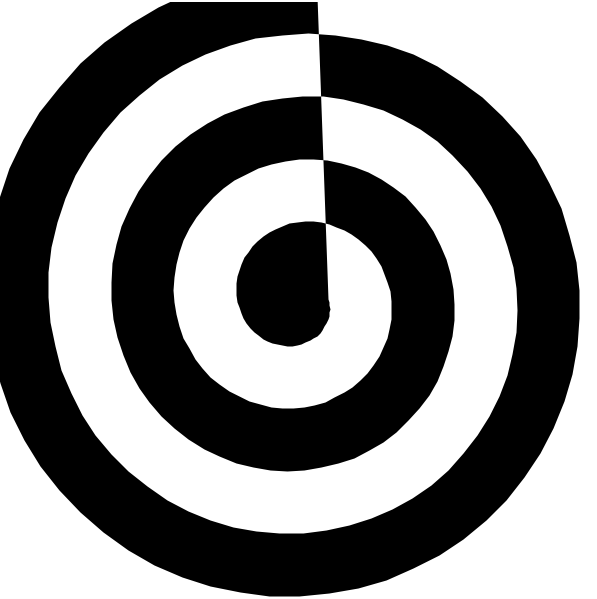

# Picture Language Help Sheet

## Building Blocks

|  |  |  |  |
| -- | -- | -- | -- |
| `rcross_bb` | `heart_bb` | `sail_bb` | `corner_bb` |

|  |  |  |  |
| -- | -- | -- | -- |
| `ribbon_bb` | `spiral_bb` | `circle_bb` | `pentagram_bb` |

|  |  |  |  |
| -- | -- | -- | -- |
| `nova_bb` | `blank_bb` | `black_bb` | `        ` |
