# Picture Language Reference Sheet

Pictures in the Picture Language are also known as *Runes*.

## Building Blocks

|  |  |  |  |  |
| -- | -- | -- | -- | -- |
| `rcross_bb` | `heart_bb` | `sail_bb` | `corner_bb` | `blank_bb` | 

|  |  |  |  |   |
| -- | -- | -- | -- | -- |
| `ribbon_bb` | `nova_bb` | `circle_bb` | `pentagram_bb` | `black_bb` |

## Display Functions

- `show`
- `anaglyph`
- `hollusion`

## Basic Operations

These functions have been provided for you to create your rune designs with. 
Complete Bonus Quests to learn more techniques and unlock more functions!

### 2D Operations

### `quarter_turn_right`

`quarter_turn_right(pic)` turns the picture `pic` 90 degrees to the right.

| Example | `pic` | Output |
| -- | -- | -- |
| `quarter_turn_right(heart_bb)` |  | 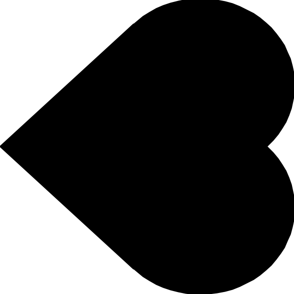 |

### `turn_upside_down`

`turn_upside_down(pic)` turns the picture `pic` by 180 degrees.

| Example | `pic` | Output |
| -- | -- | -- |
| `turn_upside_down(heart_bb)` |  | 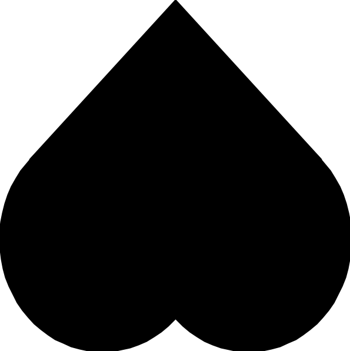 |

### `quarter_turn_left`

`quarter_turn_left(pic)` turns the picture `pic` 90 degrees to the left.

| Example | `pic` | Output |
| -- | -- | -- |
| `quarter_turn_left(heart_bb)` |  | 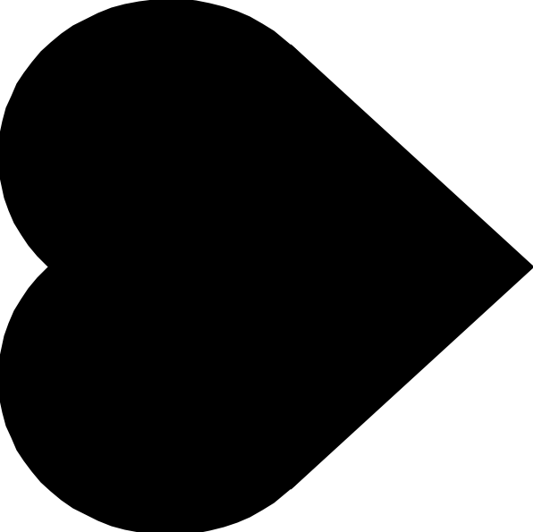 |

### `stack`

`stack(pic1, pic2)` returns a new picture with `pic1` occupying the upper half of the new picture and `pic2` occupying the lower half.

| Example | `pic1` | `pic2` | Output |
| -- | -- | -- | -- |
| `stack(rcross_bb, sail_bb)` |  |  | 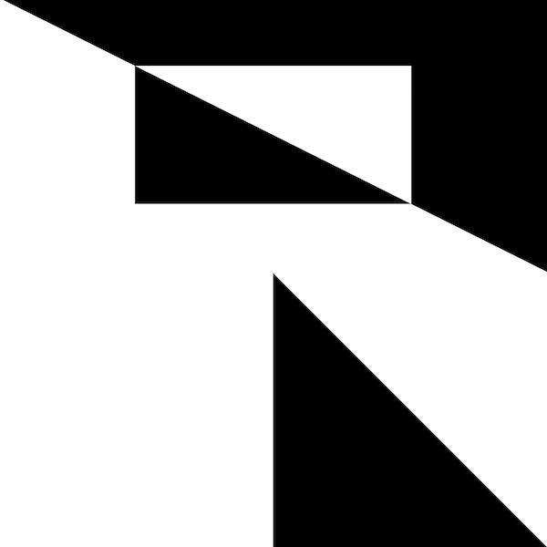 |

### `stack_frac`

`stack_frac(frac, pic1, pic2)` returns a new picture with `pic1` occupying the upper `frac` fraction of the new picture and `pic2` occupying the rest of the picture.

| Example | `pic1` | `pic2` | Output |
| -- | -- | -- | -- |
| `stack_frac(1/3, rcross_bb, sail_bb)` |  |  | 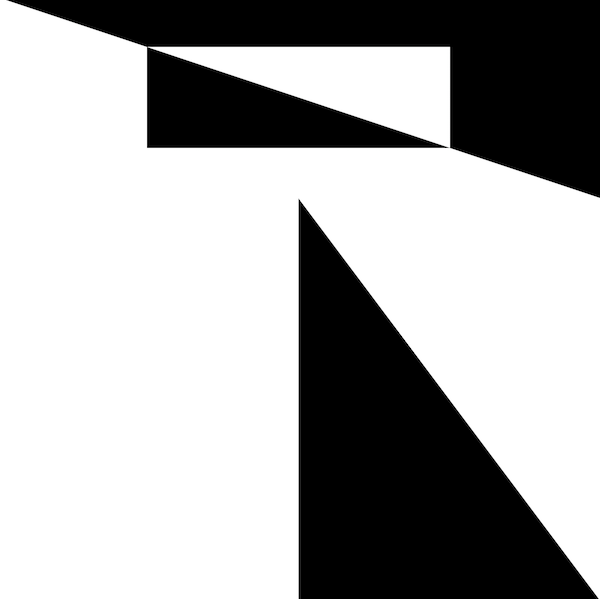 |

### `beside`

`beside(pic1, pic2)` returns a new picture with `pic1` occupying the left half of the new picture and `pic2` occupying the right half.

| Example | `pic1` | `pic2` | Output |
| -- | -- | -- | -- |
| `beside(rcross_bb, sail_bb)` |  |  | 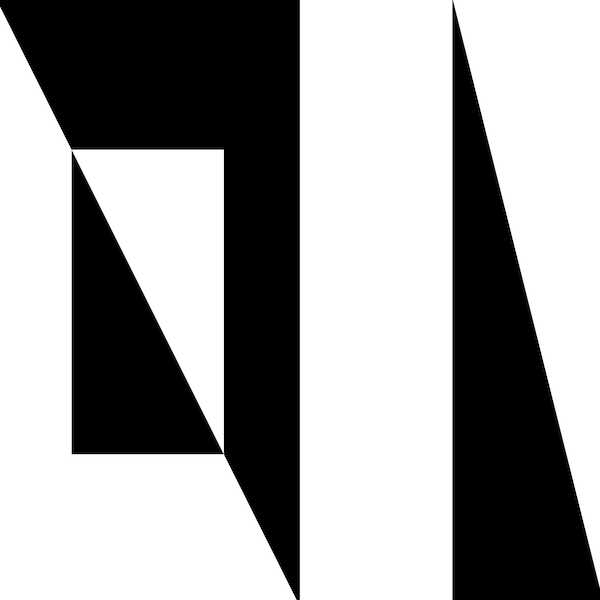 |

### `make_cross`

`make_cross(pic)` arranges `pic` in a cross pattern.

| Example | `pic` | Output |
| -- | -- | -- |
| `make_cross(rcross_bb)` |  | 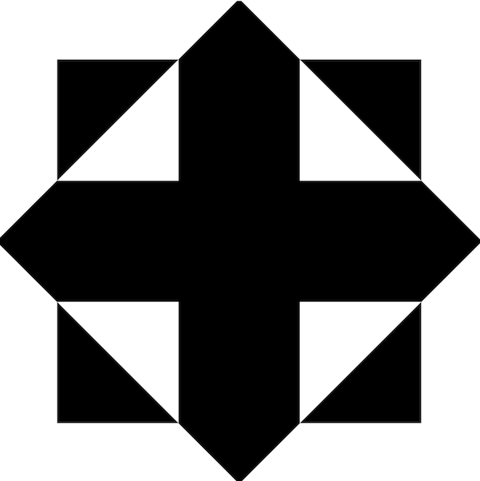 |

### `scale`

`scale(frac, pic)` scales `pic` by the fraction `frac`.

| Example | `pic` | Output |
| -- | -- | -- |
| `scale(1/2, heart_bb)` |  |  |

### `flip_horiz`

`flip_horiz(pic)` flips the picture `pic` horizontally.

| Example | `pic` | Output |
| -- | -- | -- |
| `flip_horiz(nova_bb)` |  | 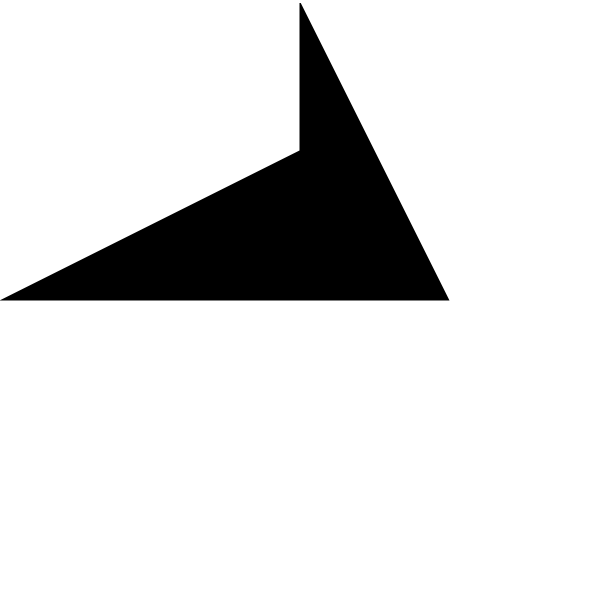 |

### `flip_vert`

`flip_vert(pic)` flips the picture `pic` vertically.

| Example | `pic` | Output |
| -- | -- | -- |
| `flip_vert(nova_bb)` |  | 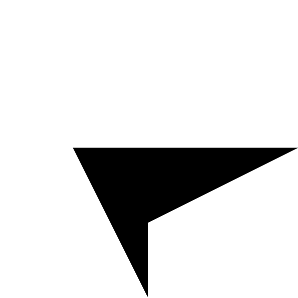 |

### `eighth_turn_left`

`eighth_turn_left(pic)` turns the picture `pic` 45 degrees to the left.

| Example | `pic` | Output |
| -- | -- | -- |
| `eighth_turn_left(heart_bb)` |  | 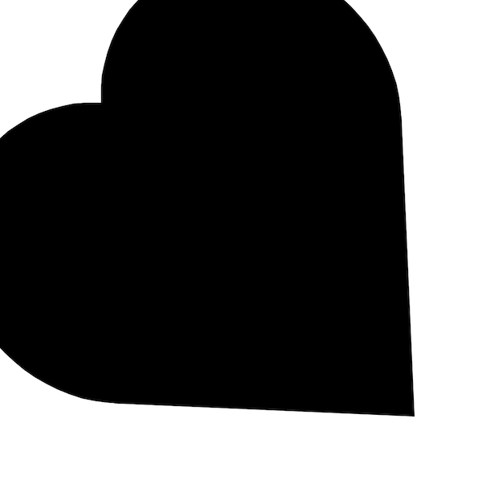 |

### `translate`

`translate(frac_right, frac_down, pic)` shifts the picture `pic` to the right by `frac_right` fraction of the picture's length and to the down by `frac_down` fraction of the length.

| Example | `pic` | Output |
| -- | -- | -- |
| `translate(1/4, 1/2, circle_bb)` |  |  |

### `ring`

`ring(n, pic)` arranges `n` number of copies of the picture `pic` in a ring.

| Example | `pic` | Output |
| -- | -- | -- |
| `ring(7, heart_bb)` |  | 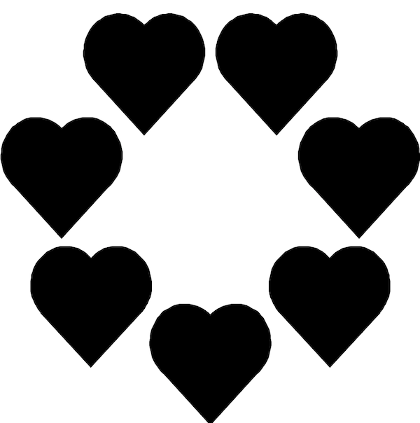 |

### `tree`

`tree(n, pic)` arranges `n` number of copies of the picture `pic` in a tree arrangement. The copies are stacked evenly on one another. The higher the layer a copy is in, the more scaled down it is.

| Example | `pic` | Output |
| -- | -- | -- |
| `tree(4, heart_bb)` |  |  |

### `stacker`

`stacker(n, pic)` stacks `n` copies of the picture `pic` evenly.

| Example | `pic` | Output |
| -- | -- | -- |
| `stacker(5, nova_bb)` |  | 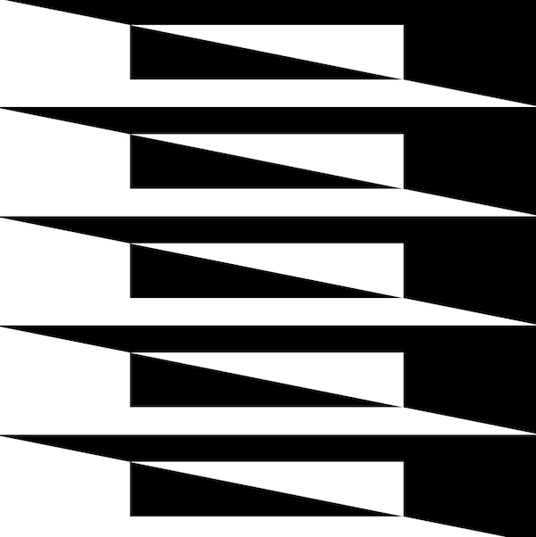 |

### 3D Operations

### `overlay`

### `overlay_frac`
