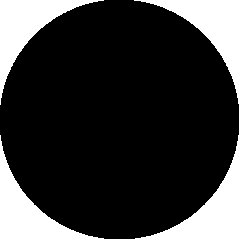

# Picture Language Help Sheet

## Building Blocks

|  |  |  |  |  |
| -- | -- | -- | -- | -- |
| `heart-bb` | `black-bb` | `pentagram-bb` | `black-bb` | `circle-bb` |

## Basic Commands

TODO

## Compound Commands

TODO

## Extra Commands

TODO
