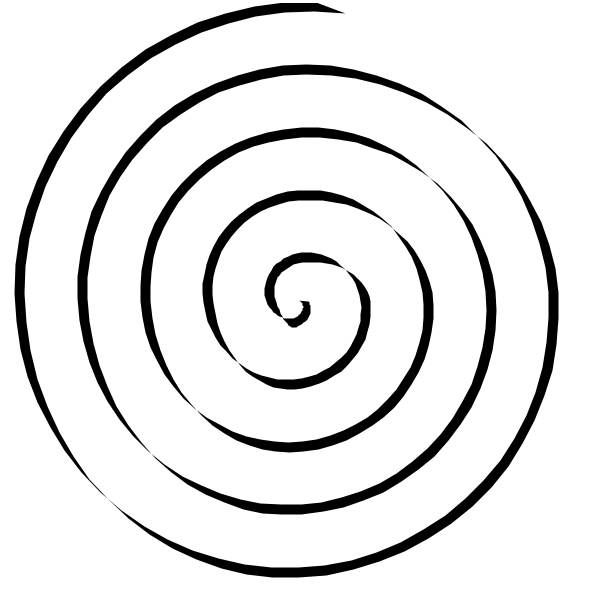

# Picture Language Help Sheet

## Building Blocks

|  |  |  |  |  |
| -- | -- | -- | -- | -- |
| `rcross_bb` | `heart_bb` | `sail_bb` | `corner_bb` | `blank_bb` | 

|  |  |  |  |   |
| -- | -- | -- | -- | -- |
| `ribbon_bb` | `nova_bb` | `circle_bb` | `pentagram_bb` | `black_bb` |

## Display Functions

- `show`
- `anaglyph`
- `hollusion`

## Basic Operations

These functions have been provided for you to create your rune designs with. 
Complete Bonus Quests to learn more techniques and unlock more functions!

### 2D Operations

### `quarter_turn_right`

`quarter_turn_right(pic)` turns the picture `pic` 90 degrees to the right.

| Example | `pic` | Output |
| -- | -- | -- |
| `quarter_turn_right(heart_bb)` |  |  |

### `turn_upside_down`

`turn_upside_down(pic)` turns the picture `pic` 180 degrees.

| Example | `pic` | Output |
| -- | -- | -- |
| `turn_upside_down(heart_bb)` |  |  |

### `quarter_turn_left`

`quarter_turn_left(pic)` turns the picture `pic` 90 degrees to the left.

| Example | `pic` | Output |
| -- | -- | -- |
| `quarter_turn_left(heart_bb)` |  |  |

### `stack`

`stack(pic1, pic2)` returns a new picture with `pic1` occupying the upper half of the new picture and `pic2` occupying the lower half.

| Example | `pic1` | `pic2` | Output |
| -- | -- | -- | -- |
| `stack(rcross_bb, sail_bb)` |  |  |  |

### `stack_frac`

`stack_frac(frac, pic1, pic2)` returns a new picture with `pic1` occupying the upper `frac` fraction of the new picture and `pic2` occupying the rest of the picture.

| Example | `pic1` | `pic2` | Output |
| -- | -- | -- | -- |
| `stack_frac(1/3, rcross_bb, sail_bb)` |  |  |  |

### `beside`

`beside(pic1, pic2)` returns a new picture with `pic1` occupying the left half of the new picture and `pic2` occupying the right half.

| Example | `pic1` | `pic2` | Output |
| -- | -- | -- | -- |
| `beside(rcross_bb, sail_bb)` |  |  |  |

### `make_cross`

### `scale`

### `flip_horiz`

### `flip_vert`

### `eighth_turn_left`

### `translate`

### `ring`

### `tree`

### `stacker`

### 2D Operations

### `overlay`

### `overlay_frac`
